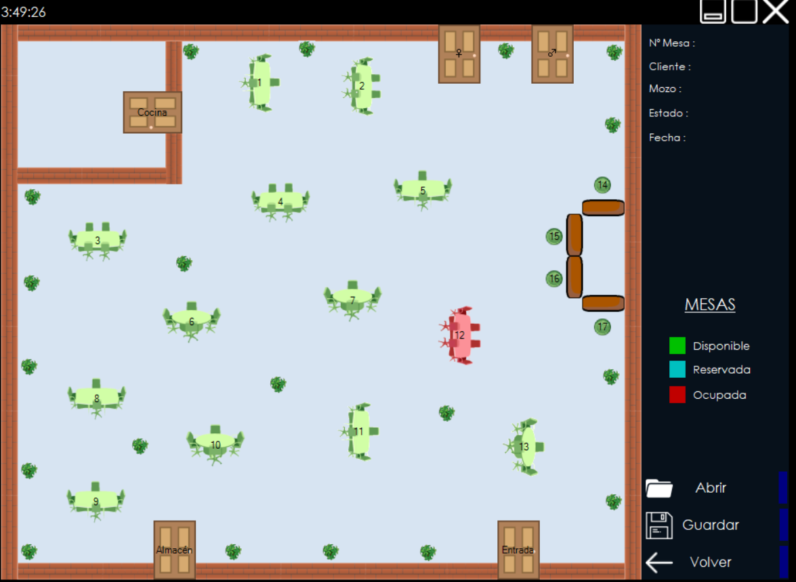

Mapa Resto - Sistema de Escritorio - C# - .NET . Almacenamiento en XML

El sistema permite crear el mapa del restaurante desde cero y guardarlo en formato XML. Al inicio se puede optar por la previsualización del mapa con las mesas y sus respectivos estados o por la edición en la que se puede cargar un archivo XML preexistente con un diseño en proceso o empezar uno nuevo desde cero. 
* El estado de las mesas pueden ser Disponibles , Ocupadas o Reservadas. Las reservas y ocupaciones se guardan junto con los datos del cliente y del mesero a atender.
* Las reservas tienen un tiempo de espera determinado, pasado este tiempo, queda disponible nuevamente. 

